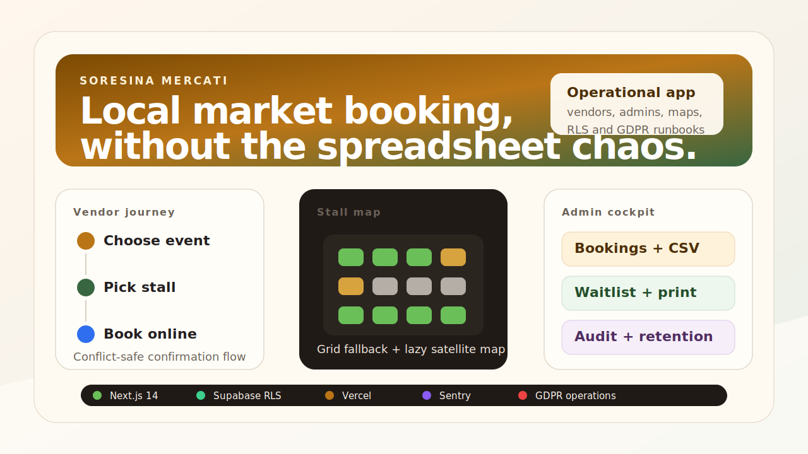
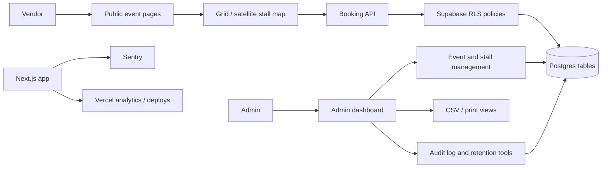

# Soresina Mercati

Full-stack booking platform for local market stalls, built for Pro Loco
Soresina. The app lets vendors browse upcoming events, select a stall on an
interactive map, book online, join a waitlist when an event is full, and lets
administrators manage events, reservations, audit logs, privacy retention and
operational exports.



## Why This Project Matters

Local market operations are usually handled with phone calls, spreadsheets and
manual coordination. This project turns that workflow into a small civic SaaS:

- vendors can self-serve reservations instead of calling the organizer;
- admins get a live booking dashboard, printable event sheets and CSV export;
- stall availability is enforced by the database, not only by the UI;
- GDPR, audit logging, rate limiting and deployment operations are documented.

The interesting part is not a landing page. It is a real operational system
with authentication, database policies, admin workflows and production runbooks.

## Product Surface

| Area | What it does |
| --- | --- |
| Public event list | Shows active markets and stall availability at a glance. |
| Event page | Displays stall status, grid/satellite map views and booking entry point. |
| Vendor account | Supports registration, login, profile data and booking ownership. |
| Booking flow | Confirms a stall, handles conflicts, consent and confirmation pages. |
| Waitlist | Lets vendors join the queue when all stalls are booked. |
| Admin dashboard | Manages events, bookings, statistics, waitlist, privacy tools and audit logs. |
| Operations layer | Documents backups, uptime monitoring, Sentry, Vercel environments and rollback. |

## Technical Stack

- **Next.js 14** with App Router
- **React 18**
- **Supabase** for Postgres, Auth and Row Level Security
- **Vercel** for deployment, analytics and preview environments
- **Sentry** for error monitoring
- **Leaflet / React Leaflet** for satellite stall maps
- **Tailwind CSS** for the interface system

## Architecture



For a deeper walkthrough, see [docs/ARCHITECTURE.md](docs/ARCHITECTURE.md).

## Data Model

Core tables and views live in [supabase/](supabase):

- `events`: market days, location, price and active status;
- `stalls`: generated stall grid for each event;
- `bookings`: confirmed/pending/cancelled reservations;
- `vendors`: authenticated vendor profiles and admin role;
- `waitlist`: event-level queue when no stall is free;
- `audit_log`: database-triggered change history;
- `stalls_with_status`: read model used by the public map.

Important constraints are enforced at database level, including a partial unique
index that prevents two confirmed bookings from owning the same stall at the
same time.

## Security And Governance

This repository includes operational documentation because the app handles real
personal data:

- [docs/SECURITY.md](docs/SECURITY.md) covers RLS, headers, rate limiting,
  admin 2FA notes and audit logging.
- [docs/GDPR.md](docs/GDPR.md) covers data categories, retention,
  anonymization, deletion and breach response.
- [docs/OPERATIONS.md](docs/OPERATIONS.md) covers backup, monitoring and
  incident response.
- [docs/DEPLOY.md](docs/DEPLOY.md) covers Vercel/Supabase environments,
  staging, Sentry and rollback.

No Supabase service role key is required by the public app. Admin operations
are routed through authenticated sessions and database policies.

## Local Setup

```bash
npm install
cp .env.local.example .env.local
npm run dev
```

Then open [http://localhost:3000](http://localhost:3000).

Required environment variables:

```bash
NEXT_PUBLIC_SUPABASE_URL=
NEXT_PUBLIC_SUPABASE_ANON_KEY=
NEXT_PUBLIC_SITE_URL=http://localhost:3000
```

Optional:

```bash
NEXT_PUBLIC_SENTRY_DSN=
SENTRY_ORG=
SENTRY_PROJECT=
SENTRY_AUTH_TOKEN=
```

## Database Setup

Create a Supabase project, then apply the SQL files in [supabase/](supabase).
The historical setup path started from [supabase/schema.sql](supabase/schema.sql)
and was extended with auth, RLS, GDPR, realtime and feature migrations.

For a clean environment, apply the migrations in the order documented by the
project notes, then create at least one admin user in Supabase Auth and assign
its role in `vendors`.

## Repository Map

```text
app/          Next.js routes, API handlers and admin pages
components/   Booking forms, maps, dashboard tables and UI widgets
lib/          Supabase clients, validation, logging and rate limiting
supabase/     Schema, RLS and feature/security migrations
docs/         Security, GDPR, operations, deploy and portfolio documentation
public/       Logos and static assets
```

## Portfolio Notes

This is a production-oriented civic web app, not a toy CRUD example. It shows:

- server/client boundary management in a real Next.js app;
- database-first integrity for reservation conflicts;
- privacy and security thinking beyond the happy path;
- admin workflows for non-technical operators;
- deployment separation between local, preview and production environments.

Read the implementation story in [docs/CASE_STUDY.md](docs/CASE_STUDY.md).
