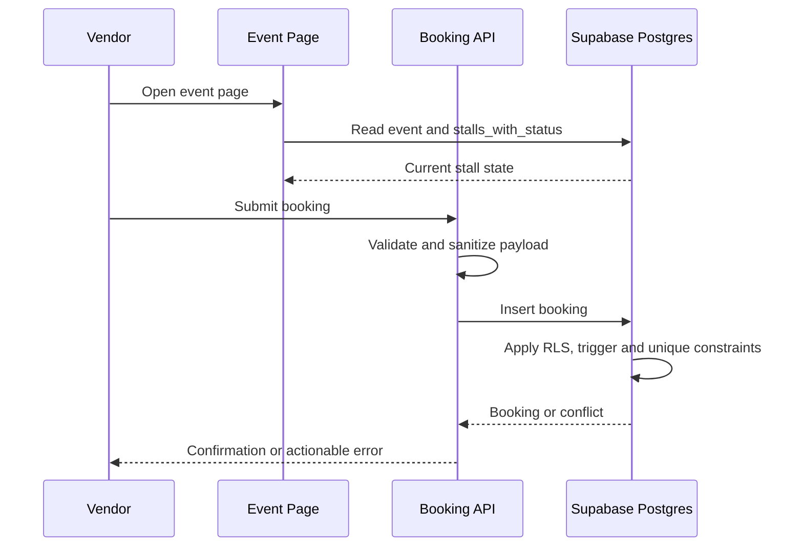
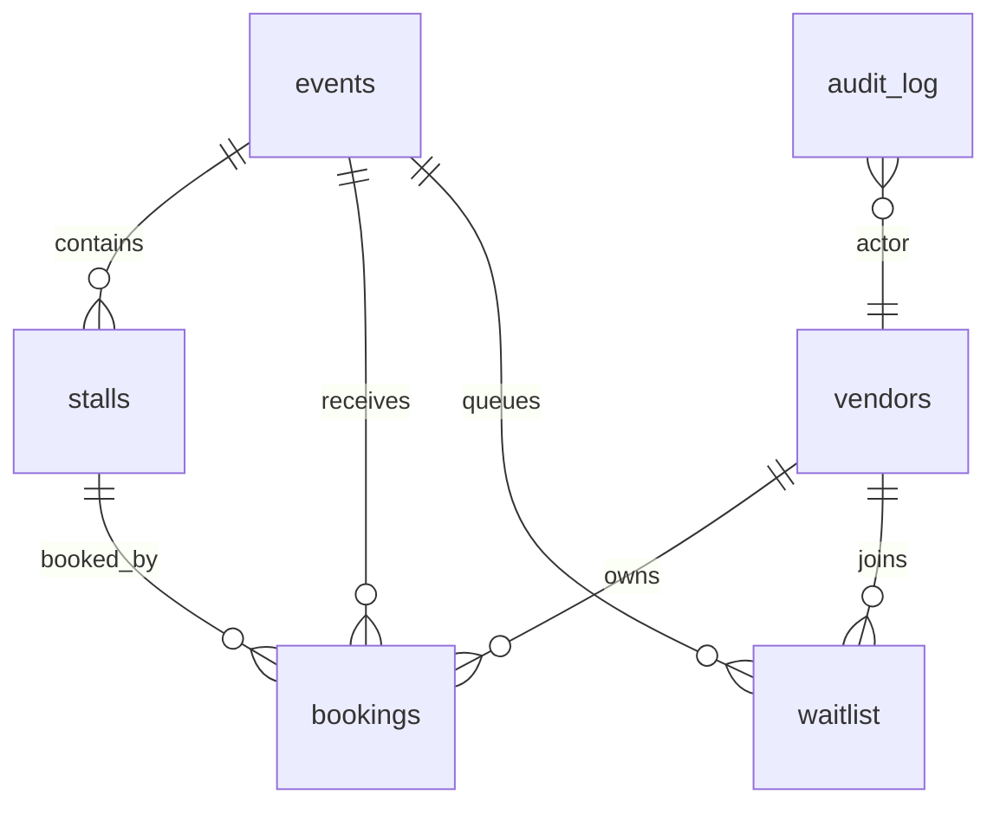

# Architecture

Soresina Mercati is a Next.js and Supabase application with three surfaces:
public market browsing, vendor booking, and admin operations.

## Runtime Components

| Component | Responsibility |
| --- | --- |
| Next.js App Router | Pages, server components, API handlers and route-level caching choices. |
| Supabase Auth | Vendor/admin login, user identity and session cookies. |
| Supabase Postgres | Event, stall, vendor, booking, waitlist and audit-log storage. |
| RLS Policies | Authorization boundary for public, vendor and admin data access. |
| Vercel | Hosting, preview deployments, analytics and environment separation. |
| Sentry | Error capture and release-level debugging. |

## Request Flow

## Data Model Summary

## Authorization Model

The app uses Supabase Row Level Security as the main data boundary.

- Anonymous users can read active events and stall status.
- Vendors can read and manage their own profile and bookings.
- Admin users can manage events, stalls, bookings, waitlists and audit views.
- Audit writes are handled by database-side logic.

The public app does not require a service-role key. If privileged background
jobs are added later, they should be isolated to server-only code paths and
documented separately.

## Caching Strategy

Event and booking pages opt out of stale rendering where correctness matters.
The home page and event pages force dynamic rendering because event activation,
stall state and bookings can change during operations.

## Observability

- `/api/health` supports uptime monitoring.
- Sentry config files cover client, server and edge runtimes.
- Vercel Analytics is initialized from the app layout.
- Operational docs describe monitoring, backup and rollback procedures.

## Production Risk Controls

- Input validation lives in `lib/validate.js`.
- Rate limiting lives in `lib/rate-limit.js`.
- Error logging uses `lib/log.js` to avoid leaking sensitive details in
  production logs.
- GDPR retention utilities live in Supabase SQL and admin API routes.
